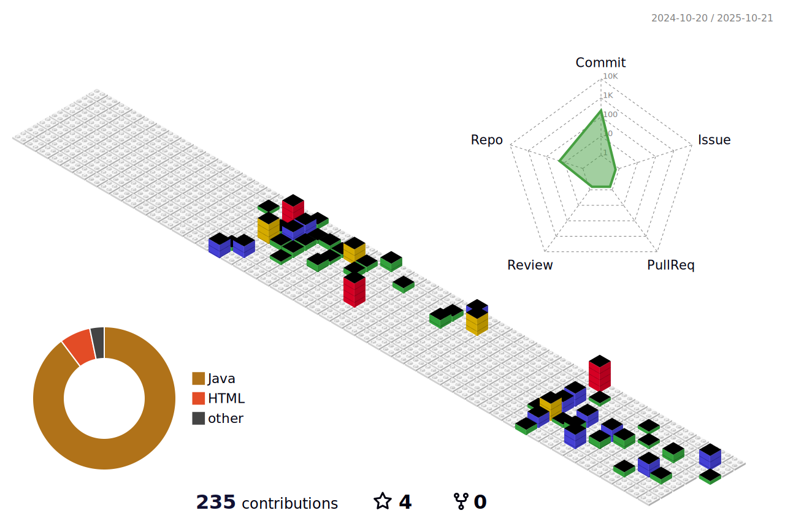

<h1 align="center">Ricardo</h1>

  Olá! Meu nome é Ricardo, moro em São Paulo capital (SP), nasci dia 19/12/2008 e faço o curso Desenvolvimento de Sistema no Senai Suíço. Estudo Java (Back-End), HTML, CSS E JavaScript (Front-End), SQL (Banco de Dados), conceitos básicos de redes, git e sistema operacional.

---

---

## Sobre

- Estudante de Back-End (Java)
- Estudante de Front-End (HTML, CSS, JS)
- Esudante de Banco de Dados (SQL)
- Esudante de Design (Figma)

## Projetos em destaque

- MNF Project

## Contato

- [LinkedIn] (link)
- [Portfólio] (link)
- [Instagram] (link)

---

> Frase Motivacional
